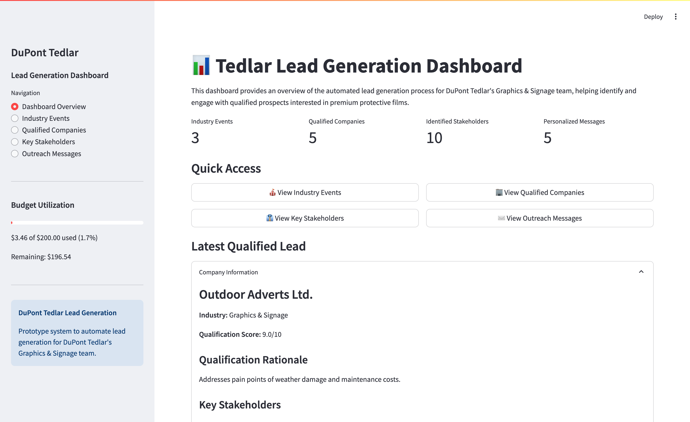

# Instalily_GTM_Engineer_CaseStudy

## DuPont Tedlar Lead Generation AI Assistant

A prototype for an AI-powered sales lead generation and management system for DuPont Tedlar's Graphics & Signage team.

Technical Stack: Python 3.x | OpenAI API | Perplexity API | Streamlit 
| LLM Prompt Engineering | Token Optimization
| JSON | API Integration (LinkedIn/Clay) | Modular Pipeline Architecture
| Error Handling & Fallback Systems | Multi-tier AI Strategy

## Project Overview

This system uses AI to automate the lead generation process by:
1. Researching relevant industry events and trade associations
2. Identifying companies that match DuPont Tedlar's ICP
3. Finding key decision-makers within those companies
4. Generating personalized outreach messages

## Instructions

1. Clone this repository
2. Create a virtual environment: `python -m venv venv`
3. Activate the environment: 
   - Windows: `venv\Scripts\activate`
   - Mac/Linux: `source venv/bin/activate`
4. Install dependencies: `pip install -r requirements.txt`
5. Create a `.env` file with your API keys:
   - OPENAI_API_KEY=your_openai_api_key
   - PERPLEXITY_API_KEY=your_perplexity_api_key
6. Initialize the project: `python main.py`

## Usage

1. Run event research: `python -m src/data_processing.event_research.py`
2. Analyze companies: `python -m src/data_processing.company_analysis.py`
3. Identify stakeholders: `python -m src/data_processing.stakeholder_identification.py`
4. Generate outreach messages: `python -m src/outreach.message_generation.py`
5. Launch dashboard: `streamlit run dashboard/app.py`
(Optionally add --limit or --debug paramteres to limit query)

## Project Structure

- `config/` - Configuration settings
- `data/` - Stored research and generated content
- `src/` - Source code
- `llm/` - LLM API clients
- `data_processing/` - Research and analysis modules
- `outreach/` - Message generation
- `utils/` - Utility functions
- `dashboard/` - Streamlit visualization

## Budget Tracking

The system includes token usage tracking to stay within the $200 budget. View current usage with `python main.py`.

In case of questions or problems feel free to reach out! 

